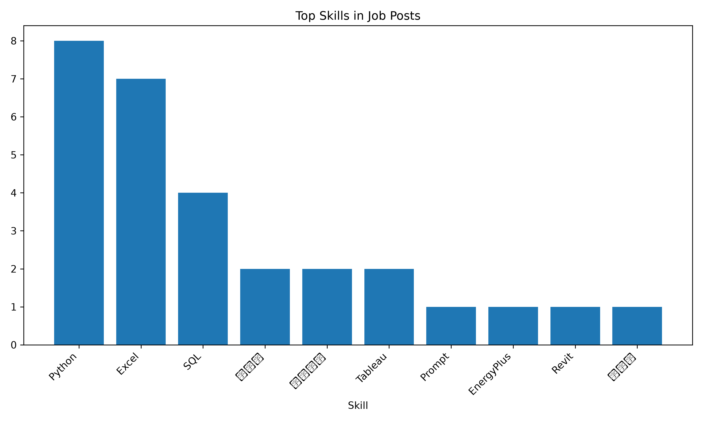
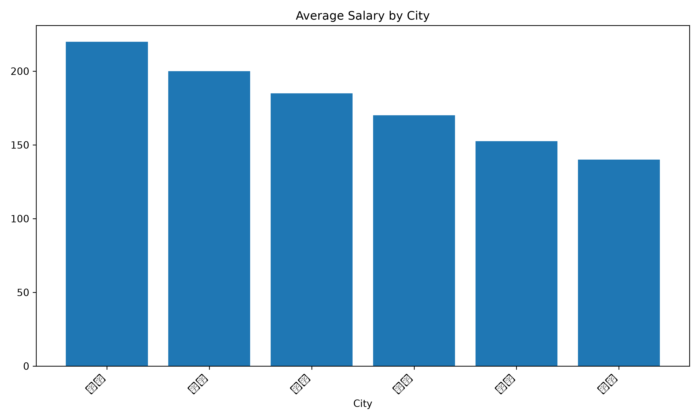
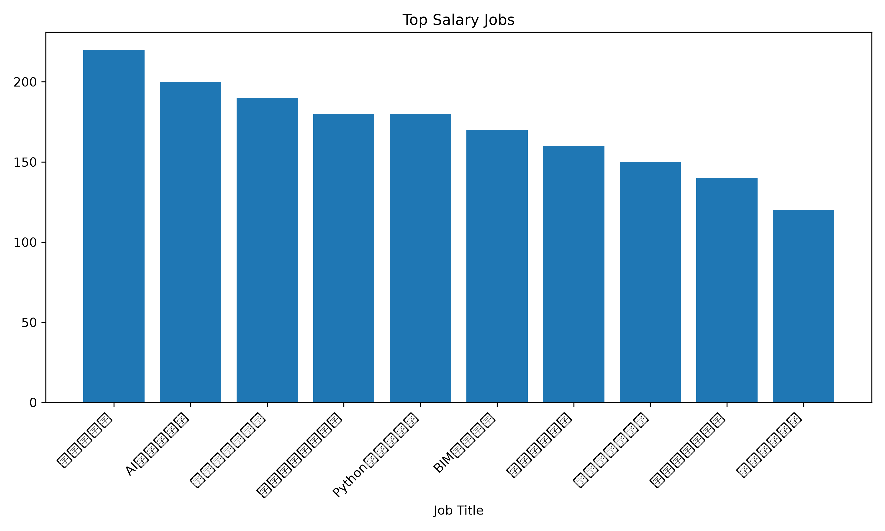

# Job Data Analysis Project

A Python-based job data analysis and visualization project.

This project uses pandas to clean and analyze job posting data, matplotlib to generate chart outputs, and Streamlit to build an interactive web dashboard. It supports both command-line analysis and web-based exploration, including CSV upload, data validation, key metrics, charts, tables, and sidebar filters.

## Project Goal

The project reads a CSV file of job postings and generates several analysis results, including:

* Data analysis related jobs
* Python related jobs
* Job counts by city
* Job title frequency
* Skill frequency
* Skill frequency in data analysis jobs
* Average salary by city
* Jobs sorted by salary
* A text summary report

## Project Highlights
* Built a reusable pandas analysis workflow for job posting data
* Refactored analysis logic into reusable functions
* Added command-line arguments with argparse
* Used pathlib to manage project paths reliably
* Added data validation for required columns and salary format
* Generated CSV outputs, text summaries, and PNG charts
* Built an interactive Streamlit dashboard
* Reused analysis functions in the web app instead of duplicating logic
* Managed development with Git branches and GitHub

## Project Structure

```text
day6/
├── data/
│   └── jobs.csv
├── output/
├── scripts/
│   └── analyze_jobs.py
├── README.md
└── requirements.txt
```

## Web Dashboard
This project includes a Streamlit web dashboard for interactive job data exploration.

Main dashboard features:

Load the default sample dataset from data/jobs.csv
Upload a custom CSV file
Validate required columns: title, city, salary, and skills
Show key metrics such as total jobs, average salary, Python-related jobs, and data analysis jobs
Display city counts and skill counts
Visualize top skills and average salary by city
Show high salary jobs
Filter jobs by city, skill keyword, and salary range

Run the dashboard with:

streamlit run app.py

## Input Data

The input file is:

```text
data/jobs.csv
```

The CSV file contains the following columns:

```text
title, city, salary, skills
```

## How to Run

Create and activate a virtual environment:

```bash
python3 -m venv .venv
source .venv/bin/activate
```

Install dependencies:

```bash
pip install -r requirements.txt
```

Run the analysis script:

```bash
python scripts/analyze_jobs.py
```

The script can also run from the `scripts` folder because it uses `pathlib.Path` to locate the project directory.

## Outputs

The analysis results are saved in the `output/` folder.

Main output files include:

```text
data_analysis_jobs.csv
python_jobs.csv
city_counts.csv
title_counts.csv
skill_counts.csv
data_analysis_skill_counts.csv
city_avg_salary.csv
city_avg_salary_sorted.csv
high_salary_jobs.csv
job_analysis_summary.txt
```

## Key Skills Practiced

This project practices:

* Reading CSV files with pandas
* Filtering rows with `str.contains()`
* Counting values with `value_counts()`
* Splitting multi-value text with `str.split()`
* Expanding list-like cells with `explode()`
* Grouping data with `groupby()`
* Sorting data with `sort_values()`
* Exporting CSV files
* Writing text summary files
* Managing project paths with `pathlib.Path`

This project is part of my Linux and pandas learning practice.

## Example Charts

The project automatically generates several charts to help visualize the job data analysis results.

### Skill Counts



This chart shows the frequency of different skills mentioned in the job dataset.

### Average Salary by City



This chart compares the average salary across different cities.

### High Salary Jobs



This chart shows selected high salary jobs from the dataset.

